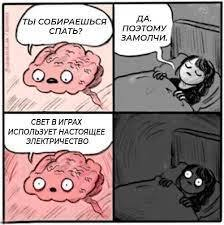

  LET'S PLAY A GAME... 

 

# ПРАВИЛА
Ну привет, дружочек-пирожочек) Давай начнём наш небольшой обмен приколюшками! Правила простые - хочешь поделиться шуточкой или мемасиком, создавай свою веточку (**пожалуйста** назови её как-нибудь оригинально, есть ***стойкое*** подозрение, что ты такой не один) и <u> *ЖГИ ГОЛУБЧИК или ГОЛУБУШКА*</u>. Можно вставлять картиночки или текстовые шуточки а можно за раз картиночку и шутейку добавить. Да, так и будем делать <u>**по 1 за раз**</u>. Я буду раз в 2 дня чекать пул реквесты (примерно в 21-00 по МСК), и добавлять их в основной репозиторий. После того, как вы добавите свою ветку, не забываем закомитить и ***САМОЕ ГЛАВНОЕ*** добавляйте название своей ветки в файл УЧАСНИКИ (сам я буду в мейне ураганить). И раз уж я начал это дело - надо пошутить). 
==================
 
 ## Итак шутка юмора №1
 > Бежит, значит, Орёл и на полном ходу головой врезается в скалу.
> Мимо шёл Медведь и, видя всё это, спрашивает:
> 
> -Орёл, ты это чего?
>
> -Да, так вы*бываюсь, - ответил ему тот
>
> Ну Медведь подумал и решил присоединиться. И вот они уже оба с разгона бегут к скале и давай головой на полном ходу о неё биться.
> Мимо Волк проходит и спрашивает: "Ребят, я вы это чего?" Те, посмотрев на волка говорят "Да так, вы*бываемся". Волк подумал-подумал и давай к ним.
> И через какое-то время уже весь лес так собрался, и с разбегу как даст головой по скале, а со скалы слезает оползень. Орёл взлетает, а остальных зажало. И тут у Орла спрашивают:
>
> -Орёл, нас прижало, что дальше делать?
>
> -А у вас крылья есть?
>
> -Нет...
>
> -А зачем тогда вы*бывались?

